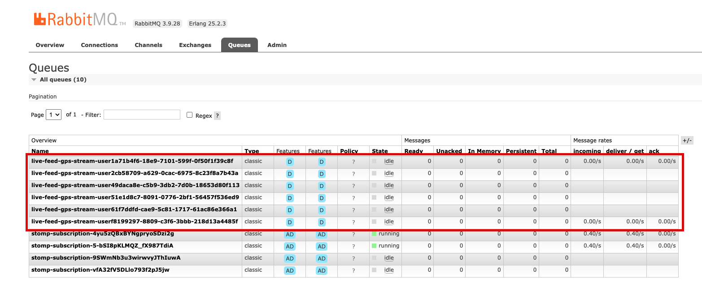
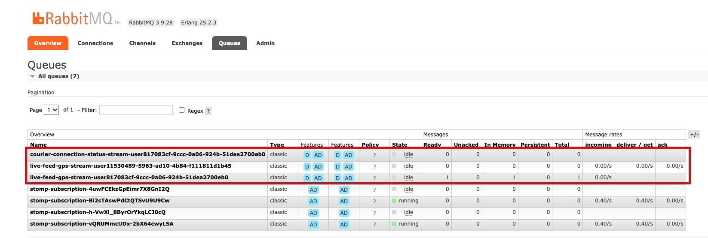
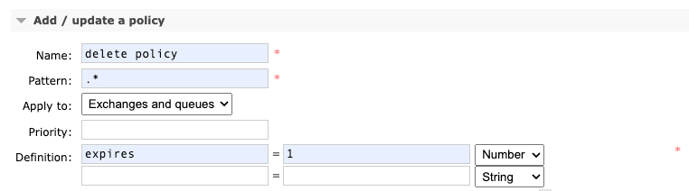

# yt-websocket

## Scaling Real-Time Communication: Unleashing the Potential with Spring, WebSocket, and RabbitMQ Integration.

Ensuring scalability has become a standard requirement in today's technology landscape. Developing with an
application/tool that lacks scalability in the world of microservices can lead to various challenges. In this article,
our YıldızTech team will share a solution we discovered while using WebSocket and address how you can develop scalable
WebSocket applications using Spring and RabbitMQ integration. Throughout the article, we will assume that the reader is
familiar with Kubernetes environment and concepts.

WebSocket is a widely used tool for real-time communication needs such as messaging, location sharing, live-streaming,
and more. In applications that involve these features, ensuring that the right message is delivered to the right person
without any loss or delay is of utmost importance. To achieve this, it is crucial for the services operating in a
distributed architecture to communicate with each other. In order to visualize the problem effectively, it will be
beneficial to illustrate the following scenarios.

|                                                                                                  |
|:------------------------------------------------------------------------------------------------:|
|  |

If we consider these scenarios one by one, the first scenario is a problem which led to the writing of this article.
When users establish a WebSocket connection, they are essentially establishing a bidirectional
end-to-end connection. As the number of users and consequently the number of connections increase, the Kubernetes
environment (if configured with Horizontal Pod Scaling [HPA] feature) will attempt to scale the overloaded services.
However, in this process, if a user receives messages from a WebSocket service other than the one they are connected
to (due to scaling to another instance), they will not be able to see those messages. Similarly, in cases where there
are multiple services and messages need to be sent to a specific user, if a message is sent to the second service while
the user is connected to the first service, the user will not receive the intended message. While it is possible to
expand these scenarios, at the end of the day, our main requirement is to ensure proper delivery of messages.

Based on our findings from previous studies, it is evident that RabbitMQ can successfully handle message
distribution [2]. As shown in the code snippet below, with the help of Spring's messaging library, RabbitMQ can be
defined as the message broker. This allows messages to be sent to the client via RabbitMQ, even when a WebSocket
connection is established. With this configuration, the messages are routed through RabbitMQ, allowing seamless
communication between the WebSocket and the client.

```java
private static final String[]APP_PREFIXES=new String[]{"/app","/exchange"};

public static final String[]BROKER_PREFIXES=new String[]{"/queue","/topic","/exchange"};

@Override
public void configureMessageBroker(MessageBrokerRegistry registry){
    registry.setPreservePublishOrder(true)

    .setApplicationDestinationPrefixes(APP_PREFIXES)
    .enableStompBrokerRelay(BROKER_PREFIXES)

    .setRelayHost(environmentConfig.getRabbitUrl())
    .setRelayPort(environmentConfig.getRabbitPort())

    .setClientLogin(environmentConfig.getRabbitUser())
    .setClientPasscode(environmentConfig.getRabbitPassword())

    .setSystemLogin(environmentConfig.getRabbitUser())
    .setSystemPasscode(environmentConfig.getRabbitPassword())

    .setUserDestinationBroadcast("/topic/unresolved-user")
    .setUserRegistryBroadcast("/topic/user-registry");

    ...
    }
```

The advantage of using RabbitMQ as a message broker is twofold. First, RabbitMQ itself is scalable, allowing it to
handle large amounts of message traffic efficiently. Second, with the `UserRegistryBroadcast` parameter, messages can be
sent over the `/topic/user-registry` queue, regardless of which WebSocket pod the users are connected to. This enables
seamless message delivery to all connected users, ensuring that messages reach the intended recipients regardless of
their specific WebSocket pod.

|                                                                                                  |
|:------------------------------------------------------------------------------------------------:|
|  |

To observe the described scenario based on our sample project's logs, you can simulate it by running two different
applications with environment variables `SERVER_PORT=8080` and `SERVER_PORT=8081`. As an example, since we have added a
security layer, you need to obtain a token with the following request and assign the corresponding token to the token
parameter in the client code under `src/main/resources/client`. User information can be accessed through the
`UserDetailsConfig` class. Please note that you should replace `USERNAME` and `PASSWORD` with the actual
username and password values from UserDetailsConfig.

```shell
curl --location 'http://localhost:8080/api/v1/token/provide' \
--header 'Content-Type: application/json' \
--data-raw '{
    "username": "{USERNAME}",
    "password": "{PASSWORD}"
}'
```

To establish WebSocket connections, you can open the `two_user_two_pod.html` page located
under `src/main/resources/client` in your desired browser. Once the connection is established, you will see the
following logs in the application console. It is worth noting that a UUID is assigned for each user. Spring uses these
UUIDs to deliver messages to the respective users.

```log
// Pod 1 (Port: 8080)

2023-06-21T17:45:27.922+03:00 TRACE 2316 --- [nboundChannel-2] o.s.m.s.u.UserDestinationMessageHandler  : Translated /user/queue/live-feed-gps-stream -> [/queue/live-feed-gps-stream-user47c7efd6-7eaf-d40a-8d75-70464430f128]
```

```log
// Pod 2 (Port: 8081)

2023-06-21T17:45:27.922+03:00 TRACE 2316 --- [nboundChannel-2] o.s.m.s.u.UserDestinationMessageHandler  : Translated /user/queue/live-feed-gps-stream -> [/queue/live-feed-gps-stream-userba0eba33-91ce-12d7-72ec-4ed9305f19ae]
```

After the connection is established, when the following request is sent, it can be observed that the messages are
successfully delivered to the respective users from the first pod.

```shell
curl --location 'http://localhost:8080/web-socket/api/v1/queue/gps' \
--header 'Authorization: Bearer {TOKEN} \
--header 'Content-Type: application/json' \
--data '{
    "plateNumber": "34AB1234",
    "latitude": 40.12314,
    "longitude":38.12314
}'
```

```log 
Pod 1 (Port: 8080)

2023-06-21T17:46:28.928+03:00 TRACE 2304 --- [brokerChannel-1] o.s.m.s.u.UserDestinationMessageHandler  : Translated /user/izzet.kilic@yilditech.co/queue/live-feed-gps-stream -> [/queue/live-feed-gps-stream-user47c7efd6-7eaf-d40a-8d75-70464430f128]
2023-06-21T17:46:28.928+03:00 TRACE 2304 --- [brokerChannel-1] o.s.m.s.u.UserDestinationMessageHandler  : Translated /user/emre.kiziltepe@yilditech.co/queue/live-feed-gps-stream -> [/queue/live-feed-gps-stream-userba0eba33-91ce-12d7-72ec-4ed9305f19ae]
```

The important point to note here is that a single incoming message can be sent to two different users through a single
pod. This is made possible by RabbitMQ, which allows users to be accessed from each pod through the
mentioned `/topic/user-registry` queue.

Certainly, it is not expected that everything will be so easy. We can categorize some of the challenges we encountered
and their solutions as follows:

### Unclosed queues

After transferring our project to the testing environment as described so far, we noticed that RabbitMQ's memory started
to increase rapidly, eventually reaching a point where it became unresponsive. Upon investigating the issue, we
discovered that despite having a low number of active users in the application, there were numerous open queues.

|                                           Persistent Queues                                           |                                             Auto-Deleted Queues                                             |
|:-----------------------------------------------------------------------------------------------------:|:-----------------------------------------------------------------------------------------------------------:|
|  |  |

After a brief research, we discovered that this issue is related to RabbitMQ, and in order to enable automatic
closing of queues, the `auto-delete: true` parameter needs to be added as a `header` on both the client and server
sides [1]. With this parameter, when a user disconnects, the queues will automatically begin to close.

```javascript
//////// client side

var header = {
  'auto-delete': true
};
client.subscribe("/user/queue/{QUEUE_NAME}", function (message) {
...
}, header);
```

```java
//////// server side

var header=new HashMap<String, Object>();
    header.put("auto-delete","true");
    simpMessagingTemplate.convertAndSendToUser(...,...,...,header);
```

### Accumulation of messages in queues

Another issue arises when there are different WebSocket queues in place. When users connect to different queues
simultaneously, RabbitMQ creates separate queues for each of them. In the WebSocket service, when a message arrives in a
queue, Spring routes this message to the user based on their session ID (UUID). Let's consider the queues
`live-feed-gps-stream` and `courier-connection-status-stream` as an example. When a user connects to both queues,
different UUIDs such as `817083cf-9ccc-0a06-924b-51dea2700eb0` and `11530489-5963-ad10-4b84-f111811d1b45` are generated.
If a message is sent to the `live-feed-gps-stream` queue, a separate RabbitMQ queue is created for the other queue with
the UUID `817083cf-9ccc-0a06-924b-51dea2700eb0`, and messages accumulate there.

|                                                                                                    |                                                                                                         |
|:--------------------------------------------------------------------------------------------------:|:-------------------------------------------------------------------------------------------------------:|
|  |  |

Even if RabbitMQ queues are defined as Auto-Delete (AD), they do not automatically close when there are messages in the
queue and the connection is lost. To address this issue, we found a workaround by defining a policy in RabbitMQ (Admin >
Policies). With the following policy, we ensure that the queues that remain open when the connection is lost are also
closed:



By applying this policy, we ensure that any open queues are closed when the connection is terminated, even if there are
messages in the queue. Thanks to the solutions we mentioned above, our system has been running smoothly without any
disruptions for a long time. Scaling, when used in conjunction with a microservices architecture, enables systems to be
more flexible, fast, and usable. Each microservice can be scaled independently, allowing performance to be optimized
even under high traffic or demand. This speeds up business processes and enables users to have a seamless experience. We
hope that this article will be helpful to teams facing similar issues with WebSocket and assist them in finding
solutions.

# References

1. user782220. (2014, January 21). RabbitMQ difference between exclusive and auto-delete? Stack
   Overflow. https://stackoverflow.com/questions/21248563/rabbitmq-difference-between-exclusive-and-auto-delete
2. [spring-rabbimq-test-queue](https://github.com/borist2/spring-rabbimq-test-queue)