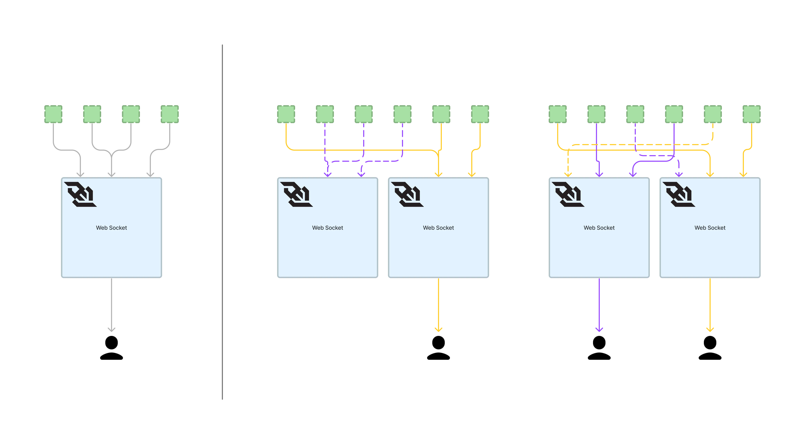
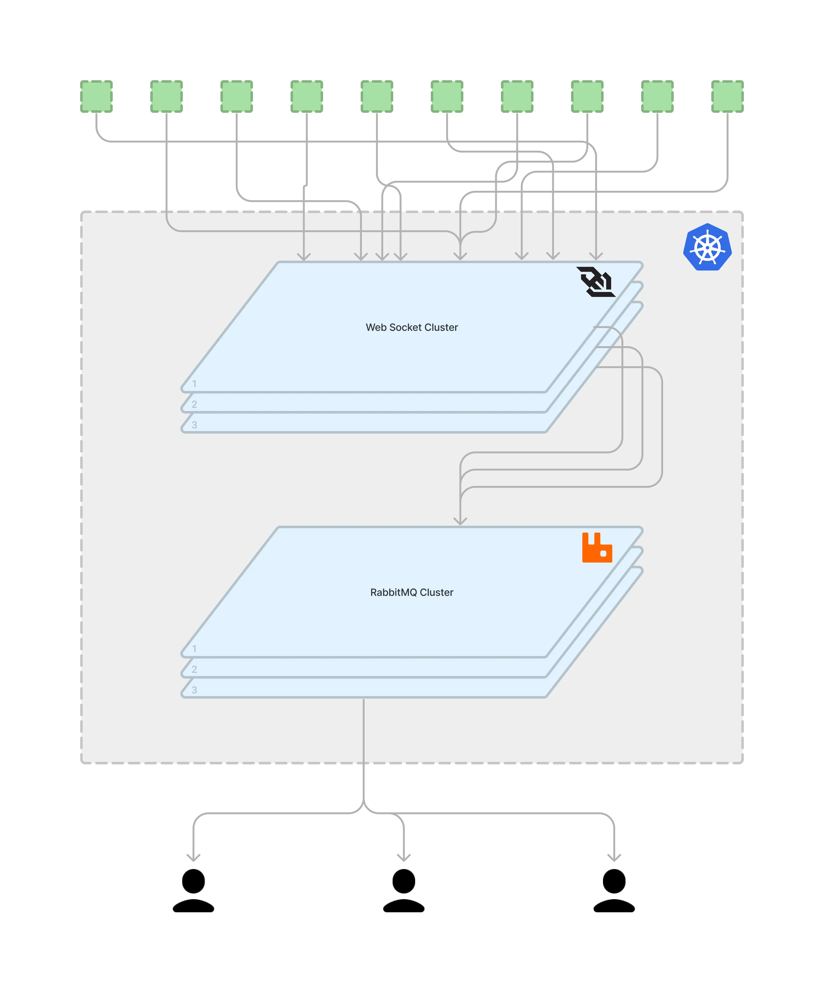
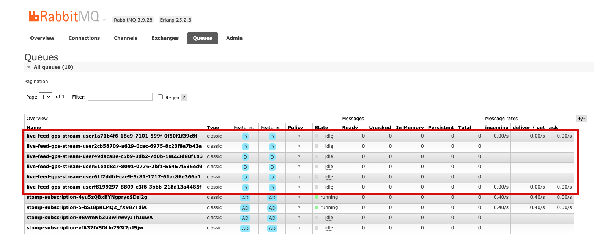
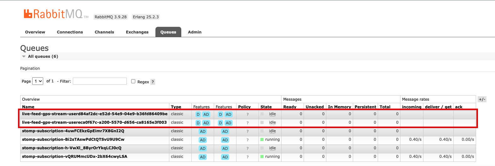
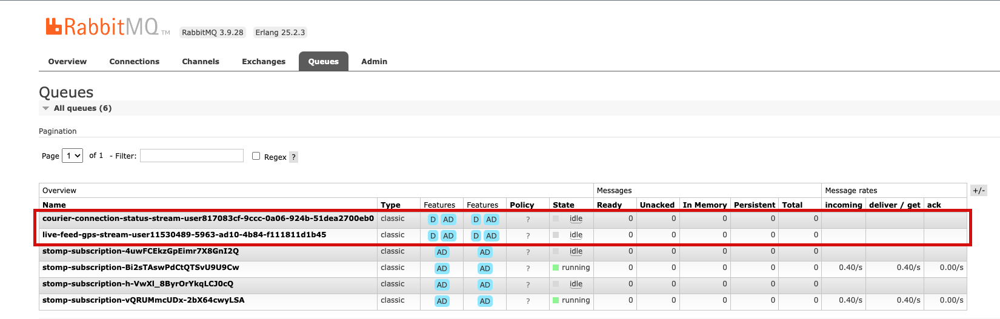
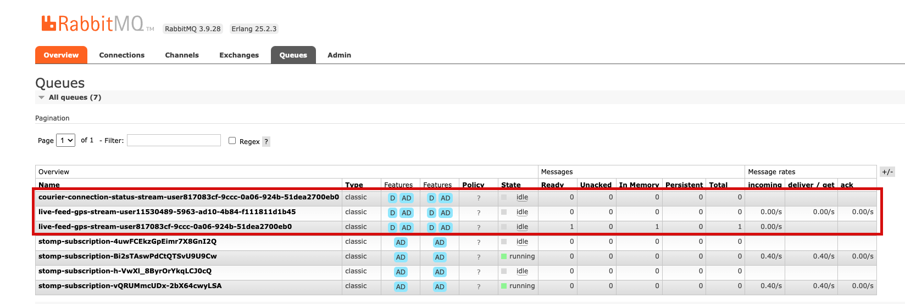
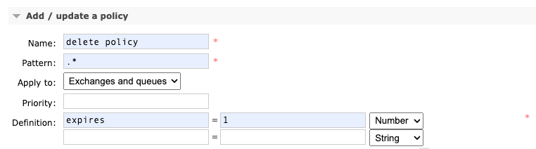

# yt-websocket

## Gerçek zamanlı iletişimde ölçeklenebilirliğin önemi: Spring, Websocket ve RabbitMQ entegrasyonu.

Bir sistemin ölçeklenebilir olması günümüz teknolojilerinde standart haline gelmiştir. Mikroservis dünyasında
ölçeklenemeyen bir uygulama/araç ile geliştirme yapmak bir çok soruna yol açmaktadır. Bu makalede, YıldızTech ekibi
olarak WebSocket kullanırken karşılaştığımız bir probleme yönelik bulduğumuz çözümü sizlerle paylaşacak ve Spring ile
RabbitMQ entegrasyonunu kullanarak nasıl ölçeklenebilir WebSocket uygulamaları geliştirebileceğinizi
anlatacağız. Yazımıza, okuyucunun, kubernetes ortamı ve kavramlarına hakim olduğunu varsayarak devam edeceğiz.

Mesajlaşma, yer gösterimi, canlı yayın vb gerçek zamanlı iletişim için ihtiyaç duyulan WebSocket yaygın kullanılan bir
araçtır. Bu özelliklerin yer aldığı uygulamalarda doğru mesajın doğru kişiye eksiksiz bir biçimde ulaştırılması en
önemli faktördür. Bunu sağlamak için dağıtık mimaride çalışan servislerin birbirleri ile de iletişim halinde olması
gerekmektedir. Bu noktada aşağıdaki senaryolar üzerinden anlatım sağlamak sorunu görselleştirme açısından faydalı
olacaktır.

|                                                                                                  |                        |
|:------------------------------------------------------------------------------------------------:|:----------------------:|
|  | figma çizimi eklenecek |

Karşımıza çıkan bu senaryoları sırayla ele alacak olursak; ilk senaryo bu makalenin de yazılmasına sebep olan bir
sorundur. Kullanıcılar istemci üzerinden bir WebSocket bağlantısı açtığında aslında uçtan uca iki yönlü bir bağlantı
kurmaktadır. Kullanıcı sayısı ve buna bağlı olarak açılan bağlantı sayısı artış gösterdiğinde kubernetes ortamı da (eğer
horizontal pod scaling [HPV] özelliği ayarlanmışsa) yük gelen servisleri ölçeklendirmek isteyecektir. Bu işlem
sonrasında kullanıcının bağlı olduğu servise değil de ölçeklendirilmiş bir başka WebSocket servisine mesaj düşmesi
halinde kullanıcı bu mesajları göremeyecektir. Yine birden fazla servis olması ve kullanıcıya özel mesaj iletilmesi
durumunda eğer kullanıcı birinci servise bağlıyken ikinci servise mesaj düşerse ilgili kullanıcıya mesaj
iletilemeyecektir. Bu senaryoları arttırmak mümkündür ama günün sonunda ihtiyacımız olan mesajların düzgün
iletilmesidir.

Daha önce yapılan çalışmalardan gördüğümüz kadarıyla RabbitMQ mesajların dağıtımını başarılı bir şekilde
gerçekleştirebilmektedir [2]. Aşağıdaki kod bloğunda görüleceği üzere Spring'in `messaging` kütüphanesi sayesinde geçiş
sunucusu olarak RabbitMQ tanımlanabilmektedir. Bu sayede WebSocket'e bağlantı açılsa da mesajlar RabbitMQ üzerinden
istemciye gönderilmektedir.

```java
private static final String[]APP_PREFIXES=new String[]{"/app","/exchange"};

public static final String[]BROKER_PREFIXES=new String[]{"/queue","/topic","/exchange"};

@Override
public void configureMessageBroker(MessageBrokerRegistry registry){
    registry.setPreservePublishOrder(true)

    .setApplicationDestinationPrefixes(APP_PREFIXES)
    .enableStompBrokerRelay(BROKER_PREFIXES)

    .setRelayHost(environmentConfig.getRabbitUrl())
    .setRelayPort(environmentConfig.getRabbitPort())

    .setClientLogin(environmentConfig.getRabbitUser())
    .setClientPasscode(environmentConfig.getRabbitPassword())

    .setSystemLogin(environmentConfig.getRabbitUser())
    .setSystemPasscode(environmentConfig.getRabbitPassword())

    .setUserDestinationBroadcast("/topic/unresolved-user")
    .setUserRegistryBroadcast("/topic/user-registry");

    ...
    }
```

RabbitMQ'u geçiş sunucusu olarak kullanmanın faydası hem kendi içinde ölçeklenebilir olması hem
de `UserRegistryBroadcast` parametresi sayesinde `/topic/user-registry` kuyruğu üzerinden kullanıcıların hangi WebSocket
poduna bağlı olduğu farketmeksizin mesajların gönderilebilmesidir.

|                                                                                                  |                        |
|:------------------------------------------------------------------------------------------------:|:----------------------:|
|  | figma çizimi eklenecek |

Yukarıda anlattığımız durumu örnek projemizin loglarına bakarak da görmemiz mümkün. Durumu simüle edebilmek adına ortam
değişkeni olarak `SERVER_PORT=8080` ve `SERVER_PORT=8081` kullanarak iki farklı uygulama ayağa kaldırılabilir. Örnek
olması açısından güvenlik katmanını da eklediğimiz için aşağıdaki istek ile token almak ve ilgili token'ı
`src/main/resources/client` altındaki istemci kodlarında token parametresine atamak gerekmektedir. Kullanıcı bilgilerine
`UserDetailsConfig` sınıfı altından erişilebilir.

```shell
curl --location 'http://localhost:8080/api/v1/token/provide' \
--header 'Content-Type: application/json' \
--data-raw '{
    "username": "{USERNAME}",
    "password": "{PASSWORD}"
}'
```

Yine `src/main/resources/client` altında bulunan `two_user_two_pod.html` sayfasını istediğimiz tarayıcıda açarak
WebSocket bağlantıları yapılabilir. Bağlantı tamamlandığında uygulamanın konsol'unda aşağıdaki loglar görünecektir.
Burada dikkat edilirse her kullanıcı için bir UUID tanımlandığı görülebilir. Spring mesajları kullanıcılara bu UUID'ler
üzerinden iletmektedir.

```log
// Pod 1 (Port: 8080)

2023-06-21T17:45:27.922+03:00 TRACE 2316 --- [nboundChannel-2] o.s.m.s.u.UserDestinationMessageHandler  : Translated /user/queue/live-feed-gps-stream -> [/queue/live-feed-gps-stream-user47c7efd6-7eaf-d40a-8d75-70464430f128]
```

```log
// Pod 2 (Port: 8081)

2023-06-21T17:45:27.922+03:00 TRACE 2316 --- [nboundChannel-2] o.s.m.s.u.UserDestinationMessageHandler  : Translated /user/queue/live-feed-gps-stream -> [/queue/live-feed-gps-stream-userba0eba33-91ce-12d7-72ec-4ed9305f19ae]
```

Bağlantı gerçekleştikten sonra aşağıdaki istek gönderildiğinde ilk poddan mesajların başarılı bir şekilde ilgili
kullanıcılara gönderildiği görülmektedir.

```shell
curl --location 'http://localhost:8080/web-socket/api/v1/queue/gps' \
--header 'Authorization: Bearer {TOKEN} \
--header 'Content-Type: application/json' \
--data '{
    "plateNumber": "34AB1234",
    "latitude": 40.12314,
    "longitude":38.12314
}'
```

```log 
Pod 1 (Port: 8080)

2023-06-21T17:46:28.928+03:00 TRACE 2304 --- [brokerChannel-1] o.s.m.s.u.UserDestinationMessageHandler  : Translated /user/izzet.kilic@yilditech.co/queue/live-feed-gps-stream -> [/queue/live-feed-gps-stream-user47c7efd6-7eaf-d40a-8d75-70464430f128]
2023-06-21T17:46:28.928+03:00 TRACE 2304 --- [brokerChannel-1] o.s.m.s.u.UserDestinationMessageHandler  : Translated /user/emre.kiziltepe@yilditech.co/queue/live-feed-gps-stream -> [/queue/live-feed-gps-stream-userba0eba33-91ce-12d7-72ec-4ed9305f19ae]
```

Burada dikkatinizi çekmek istediğimiz nokta gelen tek bir mesajın tek pod üzerinden iki farklı kullanıcıya da
gönderilebilmesidir. Bunu sağlayan; yukarıda bahsettiğimiz `/topic/user-registry` kuyruğu üzerinden kullanıcıların her
bir pod'dan erişilmesine neden olan RabbitMQ'dur.

Her şeyin bu kadar kolay olması tabi ki beklenen bir durum değildir. Karşılaştığımız bazı zorlukları ve çözümlerini
aşağıdaki gibi başlıklandırabiliriz.

### Açık kalan kuyruklar

Projemizi şimdiye kadar anlattığımız şekilde test ortamında aktardığımızdan kısa bir süre sonra RabbitMQ'nun
belleği şişmeye başladığını ve bir süre sonra cevap vermeyecek hale geldiğini gördük. Sorunu incelediğimizde uygulamayı
kullanan çok kullanıcı olmamasına rağmen bir çok kuyruğun açık olduğunu tespit ettik.

|                                          Kapanmayan Kuruklar                                          |                                         Otomatik Kapanan Kuyruklar                                          |
|:-----------------------------------------------------------------------------------------------------:|:-----------------------------------------------------------------------------------------------------------:|
|  |  |

Kısa bir araştırma sonrasında, bu durumun RabbitMQ ile ilgili olduğunu ve kuyrukların otomatik olarak kapanması
için `auto-delete: true` parametresinin hem istemci hem de sunucu tarafına `header` olarak eklenmesi gerektiğini
tespit ettik [1]. Bu parametre sayesinde, bir kullanıcı bağlantıyı kestiğinde kuyruklar otomatik olarak kapanmaya 
başlamaktadır.

```javascript
//////// client side

var header = {
  'auto-delete': true
};
client.subscribe("/user/queue/{QUEUE_NAME}", function (message) {
...
}, header);
```

```java
//////// server side

var header=new HashMap<String, Object>();
    header.put("auto-delete","true");
    simpMessagingTemplate.convertAndSendToUser(...,...,...,header);
```

### Kuyruklarda mesaj birikmesi

Bir başka sorun, farklı WebSocket kuyruklarının varlığı durumunda ortaya çıkar. Aynı anda farklı kuyruklara bağlanan
kullanıcılar için RabbitMQ tarafında iki ayrı kuyruk oluşur. WebSocket servisinde bir kuyruğa mesaj geldiğinde, Spring
bu mesajı kullanıcıya iletmek için oturum numarasına (UUID) göre yönlendirir. Örneğin, `live-feed-gps-stream`
ve `courier-connection-status-stream` kuyruklarını ele alalım. Bir kullanıcı her iki kuyruğa da
bağlandığında, `817083cf-9ccc-0a06-924b-51dea2700eb0` ve `11530489-5963-ad10-4b84-f111811d1b45` gibi farklı UUID'ler
üretilir. Eğer `live-feed-gps-stream` kuyruğuna bir mesaj gönderilirse, `817083cf-9ccc-0a06-924b-51dea2700eb0` UUID'li
diğer kuyruk için ayrı bir RabbitMQ kuyruğu oluşturulur ve mesajlar orada birikir.

|                                                                                                    |                                                                                                         |
|:--------------------------------------------------------------------------------------------------:|:-------------------------------------------------------------------------------------------------------:|
|  |  |

RabbitMQ kuyrukları Auto-Delete (AD) olarak tanımlansa bile, kuyrukta mesaj olduğu durumda bağlantı koptuğu anda
kuyruklar otomatik olarak kapanmamaktadır. Bu sorunu çözmek için RabbitMQ üzerinde (Admin > Policies) bir kural
tanımlayarak arkadan dolaşan bir çözüm bulduk. Aşağıdaki kural sayesinde, bağlantı kesildiği anda açık kalan kuyrukların
da kapanmasını sağladık.



Yukarıda bahsettiğimiz çözümler sayesinde sistemimiz bir aksama yaşamadan uzun bir süredir çalışmaktadır. Ölçeklendirme,
mikro-servis mimarisiyle birlikte kullanıldığında, sistemlerin daha esnek, hızlı ve kullanılabilir olmasını
sağlamaktadır. Her bir mikro-servis bağımsız olarak ölçeklendirilebilmesi, yüksek trafik veya talepler altında bile
performansın optimize edilmesini sağlar. Bu da iş süreçlerinin hızlanmasına ve kullanıcıların kesintisiz bir deneyim
yaşamasına olanak tanır. Umarız, WebSocket üzerinde benzer sorunlarla karşılaşan ekiplere bu yazımız faydalı olur ve
çözüm bulmalarına yardımcı olur.

# Referanslar

1. user782220. (2014, January 21). RabbitMQ difference between exclusive and auto-delete? Stack Overflow. https://stackoverflow.com/questions/21248563/rabbitmq-difference-between-exclusive-and-auto-delete
2. [spring-rabbimq-test-queue](https://github.com/borist2/spring-rabbimq-test-queue)